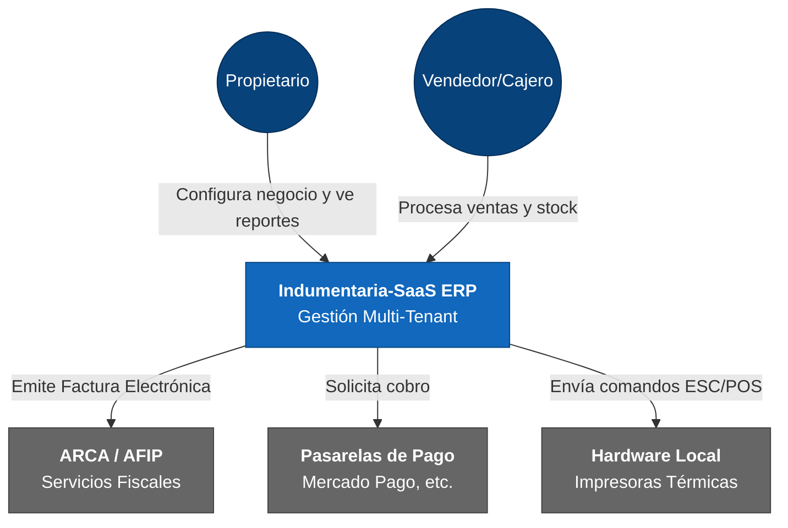
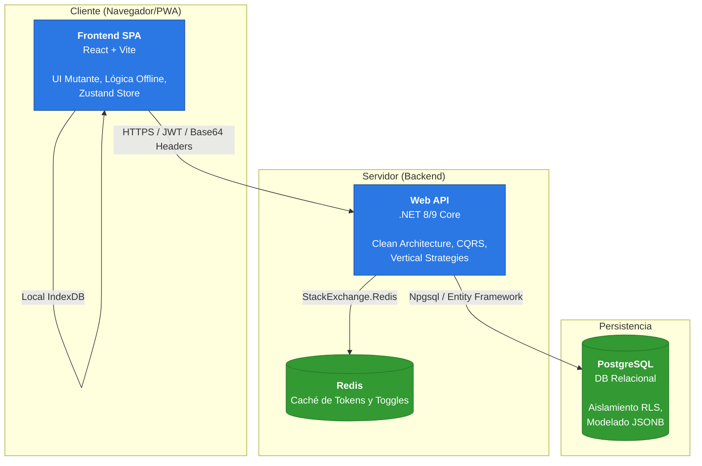

# Arquitectura de Sistema: Modelo C4

Este documento visualiza la jerarquía técnica de Indumentaria-SaaS mediante el estándar C4 y Mermaid.js.

---

## 🔝 Nivel 1: Diagrama de Contexto
Muestra el sistema como una caja negra y sus interacciones con el ecosistema externo.

---

## 🧱 Nivel 2: Diagrama de Contenedores
Desglose del sistema en sus aplicaciones y almacenes de datos principales.

---

## 🧩 Patrones Arquitectónicos Clave

### A. Multi-tenant Férreo (Aislamiento RLS)
Para garantizar la privacidad, PostgreSQL aplica políticas de **Row-Level Security**. El backend inyecta el `TenantId` en la sesión de base de datos mediante un interceptor de conexión, asegurando que las consultas nunca "vean" datos de otros inquilinos.

### B. UI Mutante (Metadata-Driven)
El sistema no usa `if (rubro == 'X')`. En su lugar, el backend envía un **Manifiesto de Rubro** (Base64 Headers) que el frontend consume para:
1. Reemplazar terminología (ej: "Prenda" vs "Artículo").
2. Resolver componentes específicos mediante un `ComponentRegistry`.

### C. Clean Architecture (CQRS)
El backend desacopla la lógica de negocio del transporte:
- **Core**: Entidades e interfaces.
- **Application**: Comandos y Queries (MediatR).
- **Infrastructure**: Implementación de persistencia y servicios externos.
- **API**: Controladores delgados.
