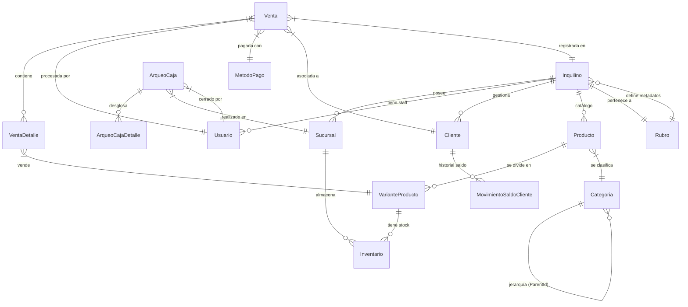

# Esquema de Base de Datos Principal

Esta sección define la "Verdad Inmutable" del almacenamiento de datos en **Indumentaria-SaaS**. El sistema utiliza **PostgreSQL** con un enfoque híbrido: Relacional para la integridad transaccional y **JSONB** para la extensibilidad de rubros (Multi-Todo).

## 📊 Diagrama Entidad-Relación (ERD)

---

## 🏛️ Tablas de Infraestructura y Tenencia

### `Inquilinos`
El corazón del aislamiento. Define la identidad de cada tienda/empresa.
- **Id** (`uuid`): Clave primaria.
- **RubroId** (`uuid`): Referencia al rubro comercial (Indumentaria, Ferretería).
- **Subdominio** (`text`): Único. Utilizado para el routing del tenant.
- **ConfiguracionTallesJson** (`jsonb`): Diccionario de talles permitidos.
- **ConfiguracionAtributosJson** (`jsonb`): Definición de campos extra por defecto.

### `Rubros`
Define la "piel" del sistema para diferentes industrias.
- **DiccionarioJson** (`jsonb`): Traducción de términos (ej: `{ "Producto": "Prenda" }`).
- **EsquemaMetadatosJson** (`jsonb`): Define qué campos adicionales requiere el rubro.

---

## 📦 Tablas de Catálogo y Stock

### `Categorias`
Soporta jerarquías infinitas y herencia de esquemas.
- **EsquemaAtributosJson** (`jsonb`): Define qué atributos deben tener los productos de esta categoría.
- **ParentId** (`uuid`, nullable): Relación recursiva para el árbol de categorías.

### `Productos`
Entidad "Padre" que agrupa variantes.
- **EsFraccionable** (`bool`): Permite venta por peso/metro (Ferretería).
- **MetadatosJson** (`jsonb`): Valores de atributos definidos por el rubro/categoría.

### `VariantesProducto`
La unidad mínima de venta (SKU).
- **ProductId** (`uuid`): FK hacia Producto.
- **Talle / Color** (`text`): Atributos core de indumentaria.
- **AtributosJson** (`jsonb`): Atributos técnicos (ej: `{ "Material": "Acero" }`).

### `Inventarios`
Relación muchos-a-muchos entre Sucursales y Variantes.
- **StockActual** (`decimal`): Cantidad disponible (soporta decimales para fraccionables).

---

## 💰 Tablas Transaccionales (POS)

### `Ventas`
Cabecera de la transacción financiera.
- **TenantId** (`uuid`): Obligatorio para RLS.
- **MontoTotal** (`decimal`): Monto final tras impuestos y descuentos.
- **EstadoVenta** (`int`): Enum (Pendiente, Pagado, Cancelado).

### `ArqueosCaja`
Control de flujo de efectivo por turno y sucursal.
- **SaldoTeorico** vs **SaldoReal**: Diferenciales para auditoría.

---

## 👥 Tablas de CRM

### `Clientes`
- **SaldoAFavor** (`decimal`): Billetera virtual para devoluciones o pagos anticipados.
- **PreferenciasJson** (`jsonb`): Historial de talles o gustos.

---

## 🔒 Reglas Core de Datos

1.  **Multitenancy (RLS)**: El 95% de las tablas incluyen la columna `TenantId`. Las políticas de PostgreSQL impiden que un inquilino vea datos de otro.
2.  **Soft Delete**: Se utiliza la interfaz `ISoftDelete` (`IsDeleted` bool) en lugar de eliminaciones físicas para preservar el historial de auditoría.
3.  **Auditoría Automática**: Las tablas heredan de `BaseEntity` para registrar `CreatedAt` y `UpdatedAt` mediante interceptores de EF Core.
